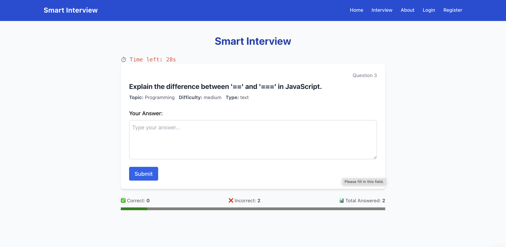
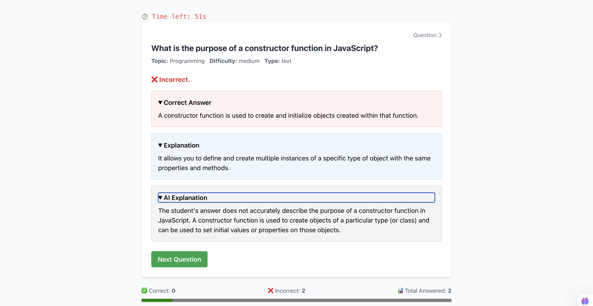

After inputing a wrong answer:

Implemented Login and Register pages with protecting the Interview page, plan to deploy.

Project setup I used:

mongod --dbpath=/Users/lejladoric/Desktop/mern-smart-interviewer/mongodb-data

mongosh

cd backend
node scripts/generateQuestions.js

npm start

cd frontend
npm start

